# SkillBridge_Career_companion


----------------------

# Career Companion - Interactive Career Guidance Platform

<div align="center">


[](https://reactjs.org/)
[](https://www.typescriptlang.org/)
[](https://tailwindcss.com/)
[](https://vitejs.dev/)
[](https://www.netlify.com/)

**🌐 [Live Demo](https://ubiquitous-queijadas-0ac6ce.netlify.app)**

*Empowering careers, one student at a time.*

</div>

---

## 🌟 Project Overview

**Career Companion** is a comprehensive, interactive web application that revolutionizes career guidance for students and graduates. We developed this platform as a passionate team from **C.V. Raman Global University** to democratize access to quality career counseling and skill development resources.

### 🎯 Our Mission
We believe every student deserves access to quality career guidance, regardless of their geographical location, financial background, or educational stream. Our platform bridges the gap between career confusion and clarity through interactive roadmaps, expert guidance, and curated learning resources.

### ✨ What Makes Us Different
- **20+ Interactive Career Paths** with detailed roadmaps
- **Expert Network Integration** with 10+ career guidance professionals
- **50+ Free Learning Resources** from industry-leading platforms
- **Progress Tracking System** with local storage persistence
- **Gaming-Inspired UI** with smooth animations and micro-interactions
- **Mobile-First Design** optimized for all devices

---

## 🚀 Live Demo & Features

### 🌐 **[Visit Career Companion](https://ubiquitous-queijadas-0ac6ce.netlify.app)**

<div align="center">

| Feature | Description | Status |
|---------|-------------|--------|
| 🎯 **Career Discovery** | Explore 20+ careers with smart filtering | ✅ Live |
| 🗺️ **Interactive Roadmaps** | Step-by-step guidance with progress tracking | ✅ Live |
| 📚 **Free Learning Hub** | 50+ external roadmaps and resources | ✅ Live |
| 👨‍🏫 **Expert Network** | Direct access to career guidance professionals | ✅ Live |
| 🎨 **Gaming UI** | Smooth animations and micro-interactions | ✅ Live |
| 📱 **Responsive Design** | Optimized for mobile, tablet, and desktop | ✅ Live |

</div>

---

## 🛠️ Technology Stack & Architecture

### **Frontend Framework**
```json
{
  "framework": "React 18.3.1",
  "language": "TypeScript 5.5.3",
  "styling": "Tailwind CSS 3.4.1",
  "build_tool": "Vite 5.4.2",
  "icons": "Lucide React 0.344.0",
  "deployment": "Netlify"
}
```

### **Why We Chose This Stack**

#### **React + TypeScript**
```typescript
// Type-safe component architecture
interface CareerCardProps {
  career: Career;
  theme: Theme;
  onClick: () => void;
}

const CareerCard: React.FC<CareerCardProps> = ({ career, theme, onClick }) => {
  // Fully typed component with IntelliSense support
  return <div className="career-card">...</div>;
};
```

#### **Tailwind CSS**
```css
/* Utility-first responsive design */
.hero-section {
  @apply min-h-screen flex items-center justify-center relative overflow-hidden
         bg-gradient-to-br from-blue-50 via-purple-50 to-pink-50
         dark:from-gray-900 dark:via-blue-900 dark:to-purple-900;
}
```

#### **Vite Build Tool**
- ⚡ **Lightning-fast HMR** for instant development feedback
- 📦 **Optimized builds** with automatic code splitting
- 🔧 **Modern tooling** with native ES modules support

---

## 📁 Project Structure

```
career-companion/
├── 📁 public/
│   └── index.html                  # HTML template with SEO meta tags
├── 📁 src/
│   ├── 📁 components/              # Reusable UI Components
│   │   ├── Header.tsx              # Navigation & Search (285 lines)
│   │   ├── Hero.tsx                # Landing with animated CTAs (180 lines)
│   │   ├── CareerGrid.tsx          # Career display grid (85 lines)
│   │   ├── CareerCard.tsx          # Individual career cards (145 lines)
│   │   ├── CareerModal.tsx         # Detailed roadmap viewer (320 lines)
│   │   ├── FreeRoadmapModal.tsx    # External learning resources (450 lines)
│   │   ├── CareerHelpModal.tsx     # Expert guidance network (380 lines)
│   │   ├── RoadmapStep.tsx         # Interactive progress steps (165 lines)
│   │   ├── Resources.tsx           # Learning materials table (290 lines)
│   │   ├── About.tsx               # Team & mission info (245 lines)
│   │   ├── Contact.tsx             # Contact form & info (310 lines)
│   │   └── Footer.tsx              # Site footer (120 lines)
│   ├── 📁 data/
│   │   └── careers.ts              # 20+ career paths with roadmaps (1200+ lines)
│   ├── 📁 types/
│   │   └── career.ts               # TypeScript interfaces (25 lines)
│   ├── App.tsx                     # Main application component (150 lines)
│   ├── main.tsx                    # Application entry point (15 lines)
│   └── index.css                   # Global styles & animations (280 lines)
├── 📄 Configuration Files
│   ├── package.json                # Dependencies & scripts
│   ├── tailwind.config.js          # Tailwind configuration
│   ├── tsconfig.json               # TypeScript configuration
│   ├── vite.config.ts              # Vite build configuration
│   └── eslint.config.js            # Code quality rules
└── 📄 README.md                    # This documentation
```

---

## 🎯 Core Features & Implementation

### 1. **Intelligent Career Discovery**

```typescript
// Smart filtering algorithm
const filteredCareers = careers.filter(career => {
  const matchesSearch = career.title.toLowerCase().includes(searchTerm.toLowerCase()) ||
                       career.description.toLowerCase().includes(searchTerm.toLowerCase()) ||
                       career.field.toLowerCase().includes(searchTerm.toLowerCase());
  
  const matchesFilter = selectedFilter === 'All' || career.stream.includes(selectedFilter);
  
  return matchesSearch && matchesFilter;
});
```

**Features:**
- 🔍 **Real-time search** across multiple fields
- 🎓 **Stream-based filtering** (B.Tech, B.Com, B.Sc, etc.)
- 📊 **Difficulty categorization** (Beginner, Intermediate, Advanced)
- 💰 **Salary range indicators** for informed decisions

### 2. **Interactive Career Roadmaps**

```typescript
// Progress tracking with local storage
const toggleStepComplete = (stepId: string) => {
  const newCompleted = completedSteps.includes(stepId)
    ? completedSteps.filter(id => id !== stepId)
    : [...completedSteps, stepId];
  
  setCompletedSteps(newCompleted);
  setProgress((newCompleted.length / career.roadmap.length) * 100);
  localStorage.setItem(`career_progress_${career.id}`, JSON.stringify(newCompleted));
};
```

**Features:**
- 🗺️ **6-8 detailed steps** per career path
- ⏱️ **Time estimates** for realistic planning
- 🛠️ **Tool recommendations** for each step
- 💾 **Progress persistence** using local storage
- 📥 **Downloadable roadmaps** in text format

### 3. **Expert Network Integration**

```typescript
// Career expert data structure
interface CareerExpert {
  name: string;
  type: 'Platform' | 'Individual Coach' | 'Influencer';
  specialization: string;
  features: string[];
  contact: {
    website?: string;
    instagram?: string;
    youtube?: string;
    email?: string;
  };
  rating: number;
  color: string;
}
```

**10+ Curated Experts:**
- 🏢 **Mindler** - Leading career counseling platform
- 🌍 **iDreamCareer** - International career guidance
- 📊 **CareerGuide.com** - Psychometric assessments
- 👩‍💼 **Diksha Arora** - Interview coach & influencer
- 📱 **@placementdrive** - Job updates & tech courses

---

## 🎨 Design Philosophy & Animation System

### **Apple-Level Design Aesthetics**

#### **Color System**
```css
:root {
  /* Primary Gradients */
  --gradient-primary: linear-gradient(135deg, #667eea 0%, #764ba2 100%);
  --gradient-success: linear-gradient(135deg, #10b981 0%, #059669 100%);
  --gradient-warning: linear-gradient(135deg, #f59e0b 0%, #d97706 100%);
  
  /* 8px Grid System */
  --space-1: 0.25rem;  /* 4px */
  --space-2: 0.5rem;   /* 8px */
  --space-4: 1rem;     /* 16px */
  --space-8: 2rem;     /* 32px */
}
```

#### **Gaming-Inspired Animations**
```css
/* Custom animation library */
@keyframes bounce-glow {
  0%, 100% {
    transform: translateY(0px) scale(1);
    box-shadow: 0 0 20px rgba(34, 197, 94, 0.4);
  }
  50% {
    transform: translateY(-10px) scale(1.05);
    box-shadow: 0 0 30px rgba(34, 197, 94, 0.6);
  }
}

@keyframes fade-in-up {
  from {
    opacity: 0;
    transform: translateY(20px);
  }
  to {
    opacity: 1;
    transform: translateY(0);
  }
}
```

#### **Interactive Button Design**
```typescript
// Animated CTA buttons with unique effects
<button className="group relative inline-flex items-center px-8 py-4 text-lg font-semibold text-white rounded-full overflow-hidden transition-all duration-300 transform hover:scale-105 hover:shadow-xl bg-gradient-to-r from-blue-500 to-purple-600">
  <span className="relative z-10 flex items-center">
    Explore Career Paths
    <ArrowRight className="w-5 h-5 ml-2 transition-transform group-hover:translate-x-1" />
  </span>
</button>

// Free Learning Button with multiple animations
<button 
  className="animate-pulse animate-bounce" 
  style={{ animation: 'pulse 2s infinite, bounce 3s infinite' }}
>
  <BookOpen className="w-5 h-5 mr-2 animate-bounce" />
  Start Free Learning
  <Sparkles className="w-5 h-5 ml-2 animate-spin" />
</button>
```

---

## 🔄 System Architecture & Flow

### **Application Flow Diagram**


### **Component Hierarchy Flow**

```mermaid
graph TB
    App[App.tsx - Root Component] --> Header[Header.tsx]
    App --> Hero[Hero.tsx]
    App --> CareerGrid[CareerGrid.tsx]
    App --> Resources[Resources.tsx]
    App --> About[About.tsx]
    App --> Contact[Contact.tsx]
    App --> Footer[Footer.tsx]
    App --> Modals[Modal Components]
    
    Header --> Search[Search Functionality]
    Header --> Filter[Filter Dropdown]
    Header --> Theme[Theme Toggle]
    Header --> Navigation[Mobile Navigation]
    
    Hero --> CTAButtons[CTA Button Group]
    Hero --> AnimatedBG[Animated Background]
    Hero --> FloatingElements[Floating UI Elements]
    
    CareerGrid --> CareerCard[CareerCard.tsx × 20+]
    CareerCard --> CardContent[Career Information]
    CareerCard --> ProgressPreview[Roadmap Preview]
    
    Modals --> CareerModal[CareerModal.tsx]
    Modals --> FreeRoadmapModal[FreeRoadmapModal.tsx]
    Modals --> CareerHelpModal[CareerHelpModal.tsx]
    
    CareerModal --> RoadmapStep[RoadmapStep.tsx × 6-8]
    RoadmapStep --> ProgressTracking[Progress Tracking]
    RoadmapStep --> LocalStorage[Local Storage Sync]
    
    style App fill:#e3f2fd
    style Modals fill:#fff3e0
    style LocalStorage fill:#e8f5e8
```


### **Data Flow Architecture**


---

## 🚀 Development Pipeline & CI/CD

### **Complete Development Workflow**


### **Build Process Details**
```bash
# Our complete build pipeline

1. Development Phase
   ├── npm run dev          # Start Vite dev server
   ├── Hot Module Reload    # Instant updates
   └── TypeScript Watch     # Real-time type checking

2. Code Quality Phase
   ├── npm run lint         # ESLint validation
   ├── Type checking        # TypeScript compilation
   └── Import validation    # Dependency analysis

3. Build Phase
   ├── npm run build        # Production build
   ├── Asset optimization   # Image/CSS minification
   ├── Code splitting       # Chunk generation
   └── Bundle analysis      # Size optimization

4. Deployment Phase
   ├── Netlify integration  # Automatic deployment
   ├── CDN distribution     # Global content delivery
   └── Domain configuration # Custom domain setup
```

### **Performance Optimization Pipeline**
```typescript
// Vite configuration for optimal performance
export default defineConfig({
  plugins: [react()],
  build: {
    rollupOptions: {
      output: {
        manualChunks: {
          // Vendor chunk for React libraries
          vendor: ['react', 'react-dom'],
          // UI chunk for icon libraries
          ui: ['lucide-react'],
          // Utils chunk for utility functions
          utils: ['./src/utils']
        },
      },
    },
    // Enable source maps for debugging
    sourcemap: true,
    // Optimize chunk size
    chunkSizeWarningLimit: 1000,
  },
  optimizeDeps: {
    // Pre-bundle dependencies
    include: ['react', 'react-dom'],
    exclude: ['lucide-react'],
  },
});
```

---

## 🎨 UX/UI Design Philosophy & Implementation

### **Design System Architecture**
We built our design system following **Apple's Human Interface Guidelines** and **Material Design principles**, creating a cohesive visual language that prioritizes user experience.

#### **1. Color Psychology & System**
```css
/* Our comprehensive color palette */
:root {
  /* Primary Brand Colors */
  --primary-50: #eff6ff;
  --primary-500: #3b82f6;
  --primary-900: #1e3a8a;
  
  /* Semantic Colors */
  --success: #10b981;    /* Achievement, completion */
  --warning: #f59e0b;    /* Caution, intermediate */
  --error: #ef4444;      /* Danger, advanced difficulty */
  --info: #06b6d4;       /* Information, tips */
  
  /* Gradient Combinations */
  --gradient-primary: linear-gradient(135deg, #667eea 0%, #764ba2 100%);
  --gradient-success: linear-gradient(135deg, #10b981 0%, #059669 100%);
  --gradient-warm: linear-gradient(135deg, #f59e0b 0%, #d97706 100%);
}
```

#### **2. Typography Hierarchy**
```css
/* Typography system with perfect ratios */
.typography-system {
  /* Display Typography */
  --text-display: 4rem;      /* 64px - Hero headlines */
  --text-h1: 3rem;           /* 48px - Page titles */
  --text-h2: 2.25rem;        /* 36px - Section headers */
  --text-h3: 1.875rem;       /* 30px - Subsections */
  
  /* Body Typography */
  --text-lg: 1.125rem;       /* 18px - Large body text */
  --text-base: 1rem;         /* 16px - Default body */
  --text-sm: 0.875rem;       /* 14px - Small text */
  --text-xs: 0.75rem;        /* 12px - Captions */
  
  /* Line Heights */
  --leading-tight: 1.2;      /* Headlines */
  --leading-normal: 1.5;     /* Body text */
  --leading-relaxed: 1.625;  /* Reading content */
}
```

#### **3. Spacing & Layout System**
```css
/* 8px grid system for consistent spacing */
.spacing-system {
  --space-1: 0.25rem;   /* 4px */
  --space-2: 0.5rem;    /* 8px */
  --space-3: 0.75rem;   /* 12px */
  --space-4: 1rem;      /* 16px */
  --space-6: 1.5rem;    /* 24px */
  --space-8: 2rem;      /* 32px */
  --space-12: 3rem;     /* 48px */
  --space-16: 4rem;     /* 64px */
  --space-20: 5rem;     /* 80px */
}
```

### **Interface Design Patterns**

#### **1. Card-Based Architecture**
```typescript
// Career Card Design Pattern
const CareerCard = () => {
  return (
    <div className="
      /* Base Structure */
      group relative p-6 rounded-2xl border cursor-pointer
      
      /* Background & Depth */
      bg-gradient-to-br from-white to-gray-50 
      border-gray-200 shadow-sm
      
      /* Hover Interactions */
      hover:scale-105 hover:shadow-2xl hover:border-blue-300
      
      /* Smooth Transitions */
      transition-all duration-500 transform
      
      /* Dark Mode Support */
      dark:from-gray-800 dark:to-gray-900 
      dark:border-gray-700 dark:hover:border-blue-500/50
    ">
      {/* Card Content */}
    </div>
  );
};
```

#### **2. Modal Design System**
```typescript
// Modal Design Pattern with Backdrop Blur
const ModalDesign = () => {
  return (
    <div className="
      /* Overlay */
      fixed inset-0 bg-black/50 backdrop-blur-sm 
      flex items-center justify-center z-50 p-4
    ">
      <div className="
        /* Modal Container */
        relative max-w-5xl w-full max-h-[90vh] 
        overflow-hidden rounded-2xl
        
        /* Glassmorphism Effect */
        bg-white/95 backdrop-blur-lg
        border border-gray-200/50
        
        /* Shadow & Depth */
        shadow-2xl shadow-black/10
        
        /* Dark Mode */
        dark:bg-gray-900/95 dark:border-gray-700/50
      ">
        {/* Modal Content */}
      </div>
    </div>
  );
};
```

### **Animation & Micro-Interaction Design**

#### **1. Gaming-Inspired Animation Library**
```css
/* Custom animation keyframes */
@keyframes bounce-glow {
  0%, 100% {
    transform: translateY(0px) scale(1);
    box-shadow: 0 0 20px rgba(34, 197, 94, 0.4);
  }
  50% {
    transform: translateY(-10px) scale(1.05);
    box-shadow: 0 0 30px rgba(34, 197, 94, 0.6);
  }
}

@keyframes fade-in-up {
  from {
    opacity: 0;
    transform: translateY(20px);
  }
  to {
    opacity: 1;
    transform: translateY(0);
  }
}

@keyframes float {
  0%, 100% { transform: translateY(0px); }
  50% { transform: translateY(-20px); }
}

@keyframes glow-pulse {
  0%, 100% { box-shadow: 0 0 20px rgba(59, 130, 246, 0.3); }
  50% { box-shadow: 0 0 30px rgba(59, 130, 246, 0.6); }
}
```

#### **2. Button Interaction Design**
```typescript
// Three-tier button hierarchy with unique animations

// Primary CTA - Explore Careers
const PrimaryCTA = () => (
  <button className="
    group relative inline-flex items-center px-8 py-4 
    text-lg font-semibold text-white rounded-full 
    overflow-hidden transition-all duration-300 
    transform hover:scale-105 hover:shadow-xl
    bg-gradient-to-r from-blue-500 to-purple-600
    hover:from-blue-600 hover:to-purple-700
  ">
    <span className="relative z-10 flex items-center">
      Explore Career Paths
      <ArrowRight className="w-5 h-5 ml-2 transition-transform group-hover:translate-x-1" />
    </span>
    {/* Animated background overlay */}
    <div className="absolute inset-0 bg-gradient-to-r from-blue-600 to-purple-700 opacity-0 group-hover:opacity-100 transition-opacity duration-300" />
  </button>
);

// Secondary CTA - Free Learning (with multiple animations)
const SecondaryCTA = () => (
  <button 
    className="
      group relative inline-flex items-center px-8 py-4 
      text-lg font-semibold text-white rounded-full 
      overflow-hidden transition-all duration-300 
      transform hover:scale-110 hover:shadow-2xl
      bg-gradient-to-r from-green-500 to-teal-600
    "
    style={{ animation: 'pulse 2s infinite, bounce 3s infinite' }}
  >
    <BookOpen className="w-5 h-5 mr-2 animate-bounce" />
    Start Free Learning
    <Sparkles className="w-5 h-5 ml-2 animate-spin" />
    
    {/* Glow effect */}
    <div className="absolute inset-0 rounded-full bg-gradient-to-r from-green-400 to-teal-400 opacity-30 blur-lg animate-ping" />
  </button>
);

// Tertiary CTA - Career Help
const TertiaryCTA = () => (
  <button 
    className="
      group relative inline-flex items-center px-6 py-3 
      text-base font-semibold text-white rounded-full 
      overflow-hidden transition-all duration-300 
      transform hover:scale-110 hover:shadow-2xl
      bg-gradient-to-r from-purple-500 to-indigo-600
    "
    style={{ animation: 'pulse 2s infinite, bounce 4s infinite' }}
  >
    <HelpCircle className="w-5 h-5 mr-2 animate-pulse" />
    Career Help & Guidance
    <Sparkles className="w-4 h-4 ml-2 animate-spin" />
  </button>
);
```

### **Responsive Design Strategy**

#### **1. Mobile-First Approach**
```css
/* Progressive enhancement strategy */
.responsive-component {
  /* Mobile Base (320px+) */
  padding: 1rem;
  font-size: 0.875rem;
  grid-template-columns: 1fr;
  
  /* Tablet Enhancement (768px+) */
  @media (min-width: 768px) {
    padding: 1.5rem;
    font-size: 1rem;
    grid-template-columns: repeat(2, 1fr);
  }
  
  /* Desktop Enhancement (1024px+) */
  @media (min-width: 1024px) {
    padding: 2rem;
    font-size: 1.125rem;
    grid-template-columns: repeat(3, 1fr);
  }
  
  /* Large Desktop (1280px+) */
  @media (min-width: 1280px) {
    padding: 2.5rem;
    grid-template-columns: repeat(4, 1fr);
  }
}
```

#### **2. Touch-Friendly Interface Design**
```css
/* Touch target optimization */
.touch-friendly {
  /* Minimum 44px touch targets */
  min-height: 44px;
  min-width: 44px;
  
  /* Adequate spacing between interactive elements */
  margin: 8px;
  
  /* Visual feedback for touch */
  transition: transform 0.1s ease;
}

.touch-friendly:active {
  transform: scale(0.95);
}
```

### **Accessibility & Inclusive Design**

#### **1. Color Contrast & Visual Hierarchy**
```css
/* WCAG AA compliant color ratios */
.accessibility-colors {
  /* Text on light backgrounds */
  --text-primary: #111827;     /* 16.94:1 ratio */
  --text-secondary: #374151;   /* 9.25:1 ratio */
  --text-tertiary: #6b7280;    /* 4.69:1 ratio */
  
  /* Text on dark backgrounds */
  --text-primary-dark: #f9fafb;   /* 18.07:1 ratio */
  --text-secondary-dark: #e5e7eb; /* 12.63:1 ratio */
  --text-tertiary-dark: #d1d5db;  /* 8.89:1 ratio */
}
```

#### **2. Focus Management & Keyboard Navigation**
```css
/* Focus indicators for keyboard navigation */
.focus-visible {
  outline: 2px solid #3b82f6;
  outline-offset: 2px;
  border-radius: 4px;
}

/* Skip links for screen readers */
.skip-link {
  position: absolute;
  top: -40px;
  left: 6px;
  background: #000;
  color: #fff;
  padding: 8px;
  text-decoration: none;
  transition: top 0.3s;
}

.skip-link:focus {
  top: 6px;
}
```

### **Performance-Optimized Design**

#### **1. CSS Optimization Strategy**
```css
/* Efficient CSS with minimal repaints */
.performance-optimized {
  /* Use transform instead of changing layout properties */
  transform: translateY(0);
  transition: transform 0.3s ease;
  
  /* GPU acceleration for smooth animations */
  will-change: transform;
  
  /* Contain layout changes */
  contain: layout style paint;
}

.performance-optimized:hover {
  transform: translateY(-4px);
}
```

#### **2. Image & Asset Optimization**
```typescript
// Lazy loading and optimization strategy
const OptimizedImage = ({ src, alt, className }) => {
  return (
    
  );
};
```

This comprehensive design system ensures that Career Companion delivers a premium user experience that's both visually stunning and functionally excellent across all devices and user contexts.

---

## 🚀 Quick Start

### **Prerequisites**
```bash
Node.js >= 18.0.0
npm >= 8.0.0
Git
```

### **Installation**
```bash
# Clone the repository
git clone https://github.com/your-username/career-companion.git
cd career-companion

# Install dependencies
npm install

# Start development server
npm run dev

# Open browser to http://localhost:5173
```

### **Available Scripts**
```bash
npm run dev      # Start development server with HMR
npm run build    # Create production build
npm run preview  # Preview production build locally
npm run lint     # Run ESLint for code quality
```

### **Build for Production**
```bash
# Create optimized build
npm run build

# Deploy to Netlify
npm run build && netlify deploy --prod --dir=dist
```

---

## 🔄 Development Pipeline & Workflow

### **Development Workflow**


### **Code Quality Standards**
```json
// ESLint configuration
{
  "extends": [
    "eslint:recommended",
    "@typescript-eslint/recommended",
    "plugin:react-hooks/recommended"
  ],
  "rules": {
    "react-refresh/only-export-components": "warn",
    "@typescript-eslint/no-unused-vars": "error"
  }
}
```

### **Build Optimization**
```typescript
// Vite configuration for performance
export default defineConfig({
  plugins: [react()],
  build: {
    rollupOptions: {
      output: {
        manualChunks: {
          vendor: ['react', 'react-dom'],
          ui: ['lucide-react'],
        },
      },
    },
  },
  optimizeDeps: {
    exclude: ['lucide-react'],
  },
});
```

---

## 📊 Project Statistics & Metrics

<div align="center">

| Metric | Value | Description |
|--------|-------|-------------|
| 📁 **Total Files** | 25+ | Well-organized codebase |
| 📝 **Lines of Code** | 4,500+ | Comprehensive implementation |
| 🎯 **Career Paths** | 20+ | Diverse career options |
| 🗺️ **Roadmap Steps** | 120+ | Detailed guidance steps |
| 📚 **Learning Resources** | 100+ | Curated external resources |
| 👨‍🏫 **Expert Coaches** | 10+ | Professional guidance network |
| 🎨 **Custom Animations** | 15+ | Engaging user interactions |
| 📱 **Responsive Breakpoints** | 4 | Mobile-first design |

</div>

---

## 🎯 Usage Guide

### **For Students**
1. 🔍 **Explore Careers**: Browse 20+ career options with smart filtering
2. 🗺️ **View Roadmaps**: Click any career for detailed step-by-step guidance
3. ✅ **Track Progress**: Mark completed steps in your learning journey
4. 📚 **Access Resources**: Use the Resources section for learning materials
5. 👨‍🏫 **Get Expert Help**: Connect with career guidance professionals

### **For Educators**
1. 📋 **Curriculum Planning**: Use roadmaps for course structure design
2. 🎓 **Student Guidance**: Direct students to relevant career paths
3. 📤 **Resource Sharing**: Share curated learning materials
4. 📈 **Progress Monitoring**: Help students track their development

### **For Career Counselors**
1. 📖 **Reference Tool**: Use comprehensive career information
2. 🤝 **Client Resources**: Share roadmaps and learning materials
3. 🌐 **Expert Network**: Connect with other career professionals
4. 📊 **Progress Tracking**: Monitor client development

---

## 🤝 Contributing

We welcome contributions from the community! Here's how you can help:

### **Development Setup**
```bash
# Fork the repository
git clone https://github.com/your-username/career-companion.git

# Create feature branch
git checkout -b feature/your-feature-name

# Make changes and commit
git commit -m "Add: your feature description"

# Push and create pull request
git push origin feature/your-feature-name
```

### **Contribution Areas**
- 🎯 **New Career Paths**: Add more career options and roadmaps
- 🎨 **Enhanced Animations**: Improve user interactions and micro-animations
- 📱 **Mobile Optimization**: Better mobile experience and touch interactions
- ♿ **Accessibility**: Improve screen reader support and keyboard navigation
- 🌍 **Internationalization**: Multi-language support for global reach

### **Code Guidelines**
1. **Type Safety**: Use TypeScript interfaces for all data structures
2. **Component Structure**: Follow our single responsibility principle
3. **Styling**: Use Tailwind CSS utility classes consistently
4. **Testing**: Add tests for new features and components
5. **Documentation**: Update README for significant changes

---

## 👥 Meet Our Team

<div align="center">

### **Team SkillBridge**
*C.V. Raman Global University, Bhubaneswar*

</div>

| Team Member | Role | Expertise | Contribution |
|-------------|------|-----------|--------------|
| 👨‍💻 **Arjun Sharma** | Full Stack Developer | React, TypeScript, System Architecture | Project lead, core development |
| 👩‍🎨 **Priya Patel** | UI/UX Designer | Design Systems, User Experience | Interface design, user interactions |
| 👨‍📊 **Rohit Kumar** | Data Analyst | Data Processing, Analytics | Career data curation, filtering logic |
| 👩‍📝 **Sneha Reddy** | Content Strategist | Content Creation, Research | Career content, resource curation |
| 👨‍💼 **Vikash Singh** | Product Manager | Product Strategy, QA | Feature planning, quality assurance |

### **Our Journey**
Our journey began at the **Infosys Hackathon**, where we identified the critical need for accessible career guidance. What started as a 48-hour hackathon project has evolved into a comprehensive platform that continues to grow and adapt to student needs.

### **Our Commitment**
We believe that skill empowerment shouldn't be restricted by geography, background, or cost. Through Career Companion, we're committed to ensuring equitable access to career development resources for everyone.

---

## 🔮 Future Roadmap

### **Phase 1 (Current) ✅**
- ✅ Core career exploration with 20+ paths
- ✅ Interactive roadmaps with progress tracking
- ✅ Expert network integration
- ✅ Comprehensive learning resources
- ✅ Gaming-inspired UI with animations

### **Phase 2 (In Development) 🔄**
- 🔄 User authentication and profiles
- 🔄 Personalized career recommendations
- 🔄 Community features and discussions
- 🔄 Mobile application (React Native)
- 🔄 Advanced analytics dashboard

### **Phase 3 (Vision) 🔮**
- 🔮 AI-powered career matching algorithm
- 🔮 Virtual mentorship programs
- 🔮 Industry partnership integrations
- 🔮 Certification tracking system
- 🔮 Multilingual support

---

## 📄 License & Legal

This project is licensed under the **MIT License** - see the [LICENSE](LICENSE) file for details.

### **Open Source Commitment**
We believe in the power of open source to democratize education and career guidance. This project is free to use, modify, and distribute under the MIT license.

---

## 🙏 Acknowledgments

We extend our heartfelt gratitude to:

- 🗺️ **[Roadmap.sh](https://roadmap.sh)** for comprehensive learning roadmaps
- 🎨 **[Lucide React](https://lucide.dev)** for beautiful, consistent icons
- 💨 **[Tailwind CSS](https://tailwindcss.com)** for rapid, responsive styling
- ⚛️ **[React Community](https://reactjs.org)** for excellent documentation and support
- 🏫 **C.V. Raman Global University** for supporting innovation and creativity
- 🏆 **Infosys Hackathon** for providing the initial inspiration and platform
- 🌟 **Open Source Community** for tools and libraries that made this possible

---

## 📞 Contact & Support

<div align="center">

### **Get in Touch**

[](https://ubiquitous-queijadas-0ac6ce.netlify.app)
[](mailto:skillbridge@cvrgu.edu.in)
[](https://cvrgu.edu.in)

</div>

### **Support Channels**
- 🐛 **Bug Reports**: Create an issue on GitHub
- 💡 **Feature Requests**: Submit enhancement proposals
- ❓ **General Questions**: Contact us via email
- 💬 **Community**: Join our discussions and forums

### **Response Time**
- 🚀 **Critical Issues**: Within 24 hours
- 🔧 **Bug Reports**: Within 48 hours
- 💡 **Feature Requests**: Within 1 week
- ❓ **General Inquiries**: Within 72 hours

---

<div align="center">

## 🌟 Star This Repository

If you find Career Companion helpful, please consider giving it a star! ⭐

[](https://github.com/your-username/career-companion/stargazers)
[](https://github.com/your-username/career-companion/network/members)

---

**Made with ❤️ by Team SkillBridge**

*Empowering careers, one student at a time.*

**🚀 [Launch Career Companion](https://ubiquitous-queijadas-0ac6ce.netlify.app)**

</div>
